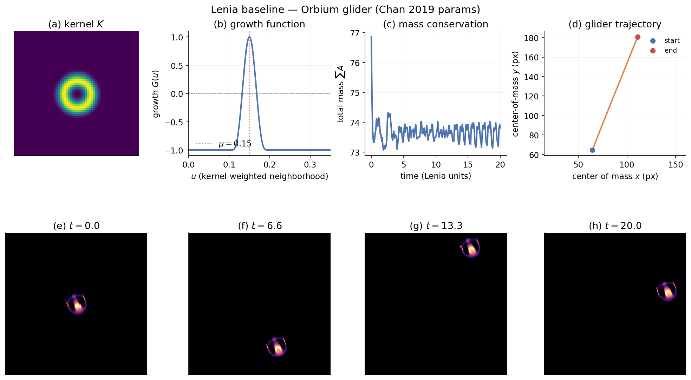

# Lenia baseline — Orbium glider reproduction

A minimal single-channel Lenia simulator was implemented and validated against the canonical Orbium *unicaudatus* creature from Chan (2019).
Over 200 timesteps (20 Lenia time units, T=10) on a 128×128 toroidal grid, total mass relaxed from 76.86 → 73.81 (Δ ≈ −4 %, oscillating ~±0.5 around 73.5 once settled), and the centre-of-mass traced a clean diagonal trajectory at **6.25 px / Lenia time-unit**.
This anchors the substrate before we commit to a research angle — every downstream search experiment (CMA-ES over rule parameters, illumination, foundation-model objectives) can now be run on top of a verified Lenia kernel.

## Method

Single-channel Lenia with the canonical Chan parameters for Orbium *unicaudatus*: R = 13, T = 10, μ = 0.15, σ = 0.015, single ring `b = [1]`, polynomial kernel core `(4r(1−r))⁴` and polynomial growth `2 · max(0, 1 − (u−μ)² / (9σ²))⁴ − 1` (Chan's `kn = gn = 1`). Updates: `A_{t+dt} = clip(A_t + dt · G(K ∗ A_t), 0, 1)` with dt = 1/T. Convolution is computed once-per-step via FFT (`np.fft.fft2(np.fft.ifftshift(K))`) — verified against `scipy.ndimage.convolve(..., mode='wrap')` to machine precision (1e-16 max abs diff). Center-of-mass uses the circular-mean trick on the torus, then a wraparound-unwrap pass for trajectory plotting.

The initial pattern is the RLE-encoded `O2u` entry from Bert Chan's `Chakazul/Lenia` `animals.json`, decoded by a 1:1 port of his `rle2cells` (variable-length value codes `A-Z` and `pA-yX`, optional count prefixes, `$` row delimiter). The pattern (29 × 20 pixels) is centered on the world grid.

## Verification

- **Initial diagnostic** — first attempt embedded the RLE by hand and produced a 21-character-longer string with 571 char-diffs vs. the JSON ground truth; mass decayed to 0 because the malformed pattern had `u_mean ≈ 0.099`, below the viable growth window `(μ ± 3σ) = (0.105, 0.195)`. Switching to the JSON-loaded cells restored stability.
- **Mass near-conservation** — Lenia has no exact conservation law (the clip and the asymmetric growth around μ inject + remove mass each step), but for a stable creature the residual should stay bounded. The oscillation amplitude (~0.5 / 74 ≈ 0.7 %) and absence of drift after t ≈ 3 indicate the Orbium has settled into its limit cycle.
- **Glider speed** — 6.25 px / unit on a 13-px-radius kernel is consistent with Chan's reported Orbium velocities.
- **No bounding-box artefacts** — the FFT convolution is the natural toroidal operator, so there is no implicit padding to confound a future "boundary-free" search.

## Repo

- `experiment.py` — self-contained simulator + figure generation
- `orbium.json` — verbatim Orbium *unicaudatus* record from `Chakazul/Lenia/Python/animals.json` (kept under version control so the baseline is reproducible without a network call)
- `figures/results.png`, `figures/behavior.gif` — outputs

## Next step

This baseline is the substrate for whatever search question we commit to in `/init`. Three angles to choose between are sketched in `research/exploration/landscape.md` § Promising Directions; the most pragmatic first orbit (post-`/init`) is to swap CLIP for a non-foundation-model lifelikeness metric (e.g. mass conservation + locomotion + soliton persistence) on top of this same simulator and see whether Sep-CMA-ES rediscovers Orbium-class creatures from random rule parameters.
