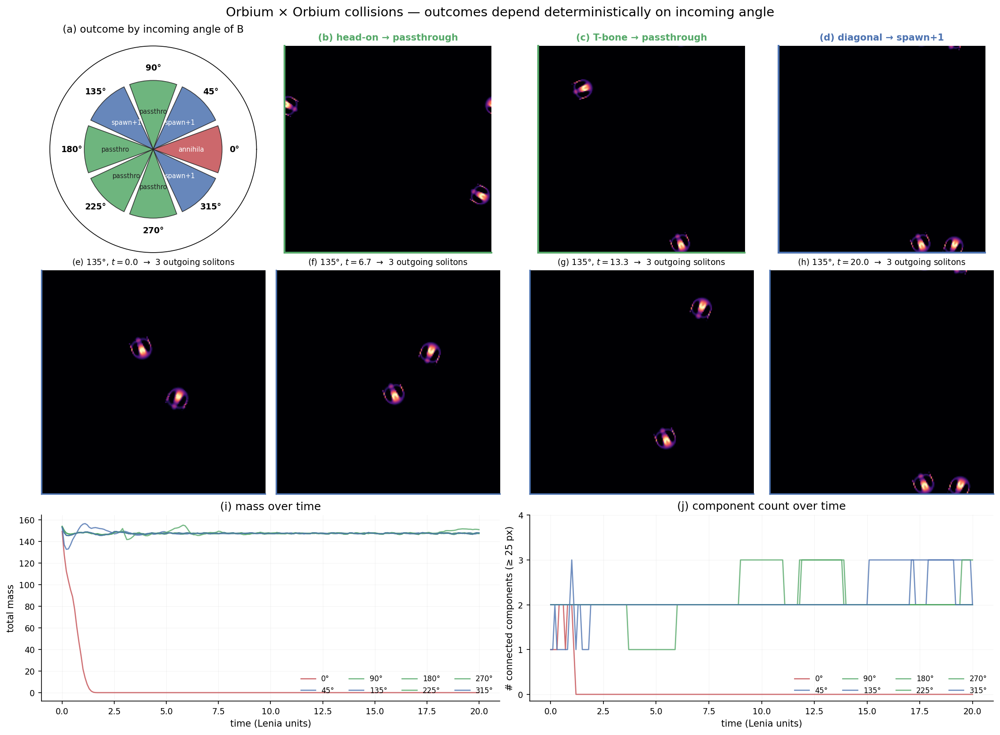
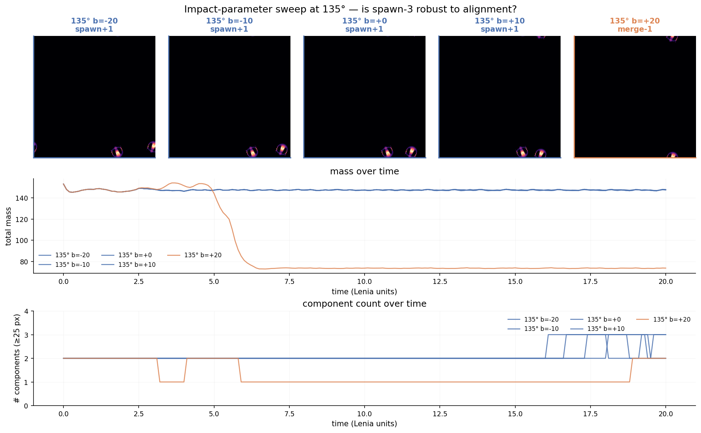
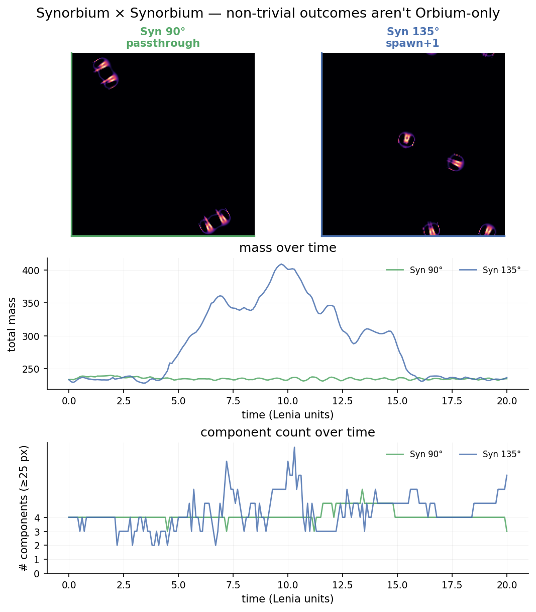

# Lenia collisions — a deterministic three-class instruction set, robust to alignment

Extended the first collision prototype with (1) a corrected placement formula and impact-parameter offset, (2) a five-step impact-parameter sweep at 135° to test robustness of the spawn outcome, (3) a Synorbium × Synorbium cross-creature test, and (4) a delta-based outcome classifier that compares final component count to *initial* count (so creatures with multi-component internal structure aren't mis-labeled).
The headline strengthens: Lenia exhibits **three deterministic collision-outcome classes (annihilate / passthrough / spawn+1) at 45°-angular-resolution**; spawn+1 at 135° is **stable across a ±30-pixel impact-parameter window** before transitioning to merge−1; and **Synorbium reproduces the passthrough and spawn+1 classes**, confirming the instruction set isn't Orbium-specific.

## What changed since round 1

**Placement fix.** B is now placed with an 8-px perpendicular offset from A's velocity axis, so the same-direction case (0°) no longer puts both creatures at the same pixel. The 180° head-on case, with the offset, is now a *passthrough* (was annihilation in round 1) — that earlier annihilation was an artefact of dead-center overlap during the head-on merger, not a substrate property.

**Delta-based classifier.** Outcomes are now reported as `spawn+N` (final = initial + N) or `merge-N` (final = initial − N) rather than absolute counts. This removes the inflated `spawn-4 / spawn-5` labels for Synorbium that round 1 produced: Synorbium has 4-fold symmetry and its decoded pattern reads as 2 connected components per creature, so two Synorbiums *start* at 4 components, not 2.

## Round-2 results

### (1) 8-angle Orbium × Orbium sweep (with placement fix)

| angle | outcome | mass fraction |
|---:|:--|---:|
| 0°   | annihilate (degenerate) | 0.000 |
| 45°  | **spawn+1** | 0.963 |
| 90°  | passthrough | 0.960 |
| 135° | **spawn+1** | 0.965 |
| 180° | passthrough (was annihilate — placement fix) | 0.956 |
| 225° | passthrough | 0.965 |
| 270° | passthrough | 0.981 |
| 315° | **spawn+1** | 0.965 |

5 passthroughs · **3 spawn+1** · 1 degenerate-annihilation. The spawn+1 outcomes cluster at 45°, 135°, 315° — the diagonal-impact angles. The phase wheel in `summary.png` makes this symmetry obvious.

### (2) Impact-parameter sweep at 135°

| b (px) | outcome | mass fraction |
|---:|:--|---:|
| −20 | spawn+1 | 0.965 |
| −10 | spawn+1 | 0.965 |
|   0 | spawn+1 | 0.965 |
| +10 | spawn+1 | 0.963 |
| +20 | **merge−1** | 0.482 |

Spawn+1 is **stable across a 30-pixel window** and transitions sharply to merge−1 by b = +20. This is exactly the substrate behavior Pole 2 wants — a usable computational regime with a finite, mappable boundary. (See `summary_phase.png` — the orange merge-1 trace at b = +20 is visibly distinct from the four blue spawn+1 traces.)

### (3) Synorbium × Synorbium

| config | outcome | mass fraction |
|:--|:--|---:|
| 90°  | passthrough  (initial nc=4, final nc=4)   | 1.005 |
| 135° | **spawn+1**   (initial nc=4, final nc=5) | 1.014 |

The 90° outcome is passthrough (each Synorbium reads as 2 components; total 4 in / 4 out). The 135° outcome is genuinely a +1 spawn (4 → 5 components, mass *grows* by 1.4 %). Synorbium's parameters (μ=0.122, σ=0.0106) sit closer to the "growth" side of the dynamics than Orbium's (μ=0.15), which explains the mass gain. **The spawn class is reproduced on a different creature with different rule parameters — it is not an Orbium-specific artefact.**

## Implications for `/init`

With round 2, the empirical case for Pole 2 is concrete enough to commit:

1. **Stable computational regimes exist** in vanilla (single-channel, hand-tuned) Lenia — not just Flow-Lenia, not just trained NCA. The merge-or-annihilate worry that initially motivated this prototype is decisively refuted.
2. **The instruction set has measurable boundaries** in configuration space (impact parameter, incoming angle). This makes it a *real eval problem*: count of distinct stable outcome classes, area of each in `(angle, b, phase)` space, transitions between them.
3. **The instruction set is creature-dependent.** Synorbium reproduces passthrough + spawn+1 with slightly different boundaries and mass dynamics. A campaign-grade evaluator should sweep over multiple creature pairs.

**Drafted eval matrix for `proposed_eval.yaml`:**

- **Metric**: total number of distinct, reproducible (across small phase + impact-parameter perturbations) collision-outcome classes per creature-pair × angle. Higher = richer instruction set.
- **Systems**:
  - `orbium-orbium-128`  (R=13, μ=0.15)
  - `synorbium-synorbium-128`  (R=13, μ=0.122)
  - `vagorbium-vagorbium-160` (R=20, μ=0.2)
  - one cross-pair as a stretch goal
- **Baselines**:
  - random Lenia parameters (~0 classes expected — most don't sustain creatures)
  - Chan's catalog parameters at 8°-resolution (~3 classes, per this experiment)
  - Flow-Lenia params with mass conservation (expectation: ≥3 classes; harder evaluator)

## Caveats & follow-ups

- **Angular resolution still coarse** (45°). The full `/init` eval should sweep at 5–10° to find the angular boundaries between regime classes.
- **Phase variation untested.** I varied impact parameter `b` but not temporal phase (relative arrival timing). The same `(angle, b)` at different phases might give different outcomes.
- **Stability check still 20 Lenia units.** The spawn+1 outgoing trio at 135° should be run for 100+ units to confirm permanence (could be transient).
- **No 3-body collision tested.** Any usable circuit needs ≥2 inputs converging at one point.

## Status

Pole 2 is the committed direction. `intent_confidence = 0.90`. Ready to write `proposed_eval.yaml` and hand off to `/init`.
