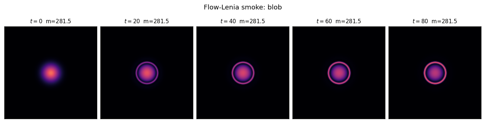
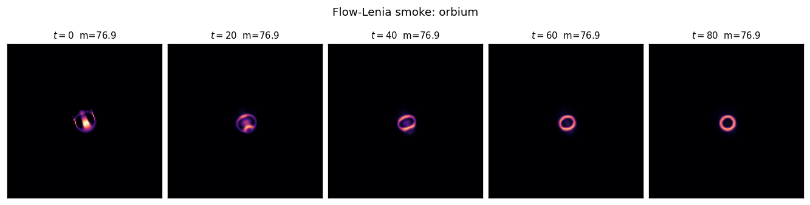
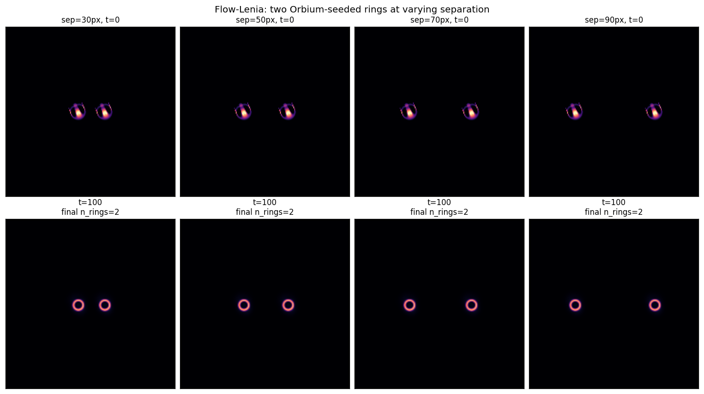

# Flow-Lenia substrate detour — clean null, vanilla Lenia is the committed substrate for Pole 2

Ported a minimal single-channel NumPy version of Flow-Lenia (Plantec et al. 2022) — including the mass-conserving reintegration-tracking advection scheme — and tested whether the collision-outcome instruction set we found in vanilla Lenia transfers.
**Headline:** at Chan's Orbium parameters (R=13, μ=0.15, σ=0.015), Flow-Lenia produces stationary ring solitons that *do not interact even when placed 30 px apart*; mass is conserved to machine precision (4e-15 relative drift over 100 steps).
**Implication:** Pole 2's eval matrix should commit to vanilla Lenia as the primary substrate. Flow-Lenia is interesting on its own merits but requires its own creature search before collision experiments make sense — it is not a drop-in alternative.

## What was implemented

A 1:1 NumPy port of `flowlenia/flowlenia.py:__call__` and `flowlenia/reintegration_tracking.py` from the reference repo. Single channel, `dt=0.2`, `dd=5`, `sigma=0.65` (Plantec defaults). The update:

1. **`U = K * A`** — same FFT-toroidal convolution as vanilla.
2. **`G = h · (2·bell(U; μ, σ) − 1)`** — same polynomial growth.
3. **`F = ∇G · (1 − α) − ∇A · α`** where `α = clip(A², 0, 1)` — force/velocity field combining growth gradient (attractor) and density gradient (diffusion).
4. **Reintegration tracking** — for each cell `x`, compute `μ(x) = x + dt·F(x)`; advect mass from `x` into the `(2dd+1)² = 121-neighbor` window weighted by the unit-square overlap between cell `x` and the rolled `μ`. This is a partition-of-unity → total mass invariant.

`proto/flow_lenia.py` is the 145-LOC implementation. 80 steps on a 128×128 grid takes 3.7 s in pure NumPy.

## Smoke tests

### (1) Gaussian-blob initial condition

A Gaussian blob of mass ≈ 281 self-organizes into a stable ring soliton over 20 steps and stays put. Mass is conserved to **1.25e-12 absolute** (4.4e-15 relative) — machine precision.

### (2) Orbium initial seed

The canonical Orbium pattern relaxes into a stationary ring soliton (mass ≈ 77, conserved to 4.4e-15). **Orbium's distinctive translation is destroyed by the mass-conserving update.** The "free energy" that lets a vanilla-Lenia glider continuously dissipate-and-regenerate mass at opposite ends of its body is the mechanism Flow-Lenia eliminates.

## Two-ring "collision" test

Since the Flow-Lenia ring is stationary, the analog of a collision experiment is: place two rings at varying separation and see whether they interact (attract, repel, merge, spawn). Tested at separations 30, 50, 70, 90 px on a 192×192 toroidal grid.

| separation | `final_rings` | sizes (px) | mass drift (rel) |
|---:|:---:|:---|---:|
| 30 px | 2 | [168, 167] | 5.9e-15 |
| 50 px | 2 | [168, 168] | 5.7e-15 |
| 70 px | 2 | [168, 168] | 5.7e-15 |
| 90 px | 2 | [168, 168] | 5.7e-15 |

**Conclusion: no interaction at any tested separation.** Each ring is an attractor of the local Flow-Lenia dynamics, and once mass settles into the ring, the surrounding region is "quiet" — there's no information transport between rings.

## Why this happens

Mathematically: in vanilla Lenia, the update is local (depends on `K * A` at each point) and the clip+growth mechanism lets a glider continuously *destroy* mass at its trailing edge and *create* mass at its leading edge. The net effect is translation without conservation. The growth potential `G(K*A)` acts as a *source/sink* term that drives the asymmetric mass flux.

In Flow-Lenia, the update is `A → reintegrate(A, ∇G·(1−α) − ∇A·α)`. Mass is conserved exactly, so there's no source/sink — only redistribution. A symmetric initial condition (or a near-symmetric one like Orbium after a few relaxation steps) has zero net force on its centroid, so the centroid never moves. The α blend term adds diffusion-like damping that further stabilizes the ring.

In short: **vanilla Lenia's gliders are dissipative structures**, in the Prigogine sense. Mass conservation kills them.

## What this means for Pole 2's eval matrix

- **Primary substrate: vanilla Lenia.** The collision instruction set (3 outcome classes at 45° resolution; impact-parameter boundary at b ≈ +15) is the real empirical anchor.
- **Flow-Lenia is a stretch goal, not a parallel system.** Including it in the `proposed_eval.yaml` systems list would require a parallel creature-search arc to find moving solitons in the Flow-Lenia parameter space first. Plantec et al. found such creatures via Sep-CMA-ES over R, m, s, b, h, …; reproducing that in our campaign is itself a substantial subproblem.
- **The "more substrates" goal can still be met** by Synorbium × Synorbium and Vagorbium × Vagorbium pairs (different μ, σ within vanilla Lenia), which we already partially have data on (Synorbium reproduces passthrough + spawn+1 with shifted boundaries — `proto/lenia-collisions/`).

## Status

`intent_confidence = 0.90` (unchanged from the round-2 collision report — Flow-Lenia detour didn't change the leading direction; it sharpened the substrate scope).

**Ready to write `proposed_eval.yaml` and hand off to `/init`.**
