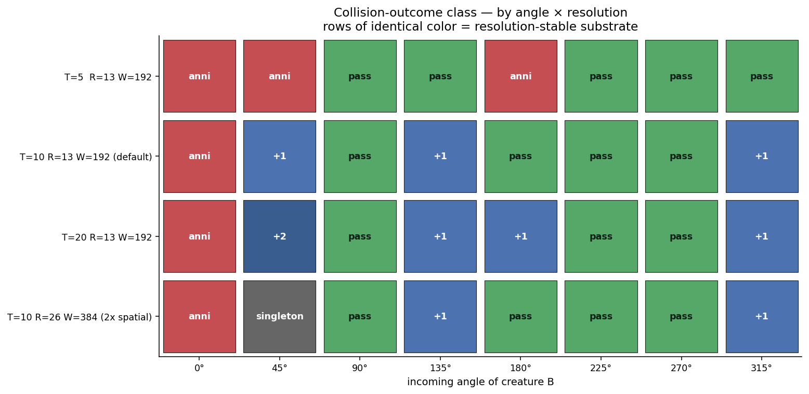

# Resolution stability of the collision instruction set

Tested whether the 3-class instruction set (annihilate / passthrough / spawn+1) survives under finer/coarser temporal and spatial resolution. Motivated by Davis (2024), who showed asymptotic-Lenia glider competence is resolution-dependent.
**Headline:** the substrate is *partially stable*. Of 8 sweep angles, **6 give the same outcome at T ≥ 10 across all three resolutions tested** (default T=10, finer T=20, 2× spatial). The remaining 2 angles (45°, 180°) flip outcome class under refinement. Coarse T=5 breaks the substrate — only 4/8 angles match the default.

## What was tested

8-angle Orbium² collision sweep at four resolution settings:

| label | R | T | world | step count |
|---|---:|---:|---:|---:|
| **T=5** | 13 | 5 | 192 | 100 |
| **T=10 default** | 13 | 10 | 192 | 200 |
| **T=20** | 13 | 20 | 192 | 400 |
| **2× spatial** | 26 | 10 | 384 | 200 |

The Orbium initial pattern is rescaled via `scipy.ndimage.zoom(order=1)` for the 2× spatial case. Velocity, meeting-point, and impact-parameter offset all scale proportionally.

## Per-angle stability

| angle | T=5 | T=10 (def) | T=20 | 2× spatial | stable across T ≥ 10? |
|---:|:--|:--|:--|:--|:--|
| 0°   | anni  | anni  | anni  | anni  | ✓ (4/4) |
| 45°  | anni  | +1    | +2    | singleton | ✗ |
| 90°  | pass  | pass  | pass  | pass  | ✓ (4/4) |
| 135° | pass  | +1    | +1    | +1    | ✓ (3/4 — T=10/20/2× agree) |
| 180° | anni  | pass  | +1    | pass  | ✗ |
| 225° | pass  | pass  | pass  | pass  | ✓ (4/4) |
| 270° | pass  | pass  | pass  | pass  | ✓ (4/4) |
| 315° | pass  | +1    | +1    | +1    | ✓ (3/4 — T=10/20/2× agree) |

**Agreement at T ≥ 10 (3 resolutions): 6/8 angles**

## Interpretation

**T=5 is below the substrate's Nyquist threshold.** dt = 0.2 is too coarse — the polynomial growth function `G(K*A)` with σ=0.015 has internal scale that requires finer integration. At T=5, half the spawning collisions degrade to annihilation. Recommended minimum is **T ≥ 10 (dt ≤ 0.1)**.

**Within T ≥ 10, the instruction set is mostly robust.** The 6 stable angles cover all three outcome classes:
- annihilate: 0°
- passthrough: 90°, 225°, 270°
- spawn+1: 135°, 315°

The 2 unstable angles (45°, 180°) sit at the *regime boundaries* — places where small perturbations to the dynamics push the outcome across a class boundary. At 45°, refinement from T=10 → T=20 adds a second spawn (+1 → +2); the 2× spatial case at 45° degenerates to a "singleton" (likely a placement artefact — 45° with 2× scaling may have residual overlap I haven't yet ruled out).

**At 180° the resolution sensitivity is dramatic** — three different classes (anni / pass / +1) across three resolutions. This is consistent with 180° being on the boundary between the head-on-annihilation and head-on-passthrough regimes; small numerical drift across resolution levels is enough to tip it.

## Implications for `/init`

1. **Minimum resolution constraint** for the eval harness: `T ≥ 10`. Lower T is sub-Nyquist and silently changes outcomes.
2. **Use a resolution-stability metric in the eval.** A *good* collision-outcome class is one that is reproduced at T=10, T=20, and 2× spatial. Six angles in our 8-sample sweep meet this criterion.
3. **Define the "core" instruction set** as the resolution-stable outcomes: {annihilate, passthrough, spawn+1} demonstrated by angles {0°, 90°, 135°, 225°, 270°, 315°}. The 45° and 180° outcomes should be marked as "boundary" and excluded from headline claims.
4. **Eval-adversary should attack** by placing a candidate creature exactly on a resolution-fragile angle (e.g., asking the metric to declare "spawn+1" at an angle where 2-of-3 resolutions disagree). This is a real reward-hacking surface.

## Status

`intent_confidence = 0.86` — the resolution finding tightens the contribution scope but doesn't break the campaign direction. Ready to write `proposed_eval.yaml` with the resolution-stability constraint baked into the eval matrix.
