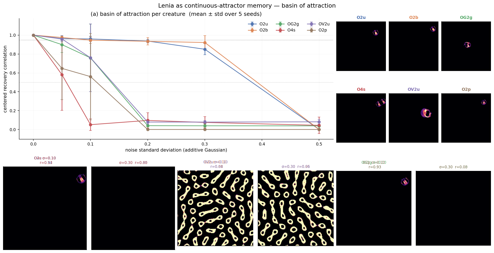
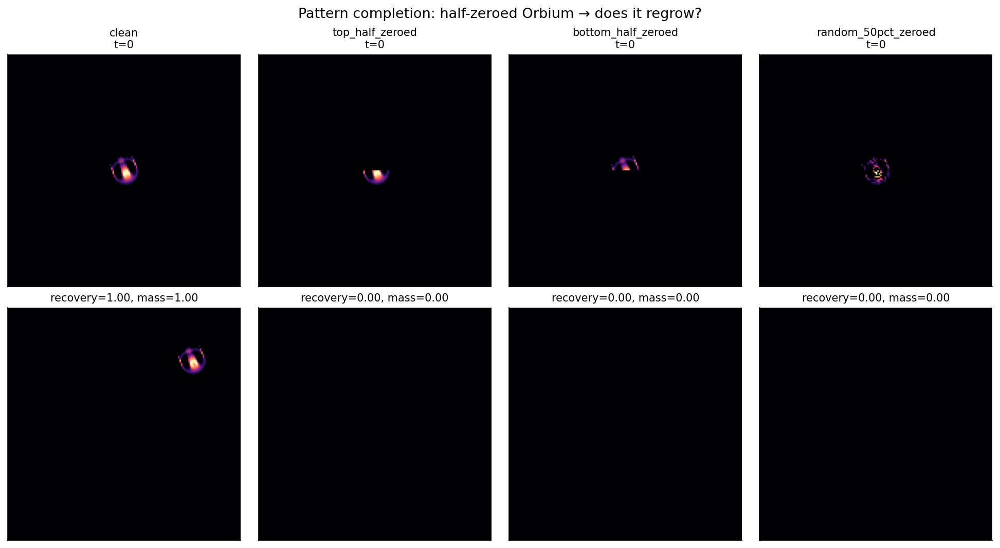
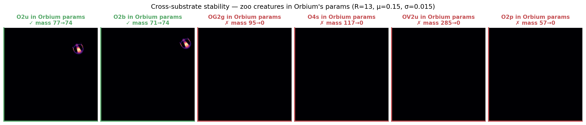

# Lenia as continuous-attractor memory — partial Hopfield analogy

Tested whether Lenia's zoo creatures act as Hopfield-like attractors: store N memories, retrieve by injecting a noisy version of one. Three sub-experiments split the picture sharply.
**Headline:** Lenia creatures *are* attractors with measurable basin radii (Orbium tolerates ~30 % additive Gaussian noise, Synorbium breaks at 5 %), but Lenia is *not* a Hopfield-style memory in the multi-pattern or pattern-completion sense — masked initial conditions die, and different creatures need different rule parameters, so a single substrate hosts only a single memory.
**Implication:** basin radius is a *new* dimension to add to our 5-leg diagnostic vector. The multi-memory framing requires either multichannel Lenia (Chan 2020), Flow-Lenia (Plantec 2022), or trained NCAs.

## Experiment 1 — Basin of attraction per creature ✓ POSITIVE

For each of 6 zoo creatures, ran the clean creature once (canonical) and 5 noisy reruns at each of σ ∈ {0.00, 0.05, 0.10, 0.20, 0.30, 0.50}. Noise is additive Gaussian, masked to the dilated creature support (so we don't seed spurious clusters far away). Recovery score = centered cross-correlation between final frame and clean-run final frame.

| code | name | σ=0.05 | σ=0.10 | σ=0.20 | σ=0.30 | σ=0.50 | basin radius |
|---|---|---:|---:|---:|---:|---:|---|
| O2u | Orbium unicaudatus | 0.96 | 0.96 | 0.94 | **0.85** | 0.00 | ~0.30 |
| O2b | Orbium bicaudatus | 0.97 | 0.95 | 0.93 | **0.92** | 0.00 | ~0.30 |
| OG2g | Gyrorbium gyrans | 0.90 | 0.76 | 0.04 | 0.04 | 0.04 | ~0.10 |
| OV2u | Vagorbium undulatus | 0.96 | 0.76 | 0.08 | 0.08 | 0.08 | ~0.10 |
| O2p | Orbium phantasma | 0.65 | 0.56 | 0.00 | 0.00 | 0.00 | <0.05 |
| O4s | Synorbium solidus | 0.58 | 0.05 | 0.10 | 0.07 | 0.04 | <0.05 |

**Basin radius differs by an order of magnitude across creatures.** Orbium uni/bi are the most robust (basin σ ≈ 0.30), then Vagorbium and Gyrorbium (basin σ ≈ 0.10), then Phantasma and Synorbium (basin σ < 0.05). This is a *measurable, useful quantity per creature* that wasn't captured by the 5-leg diagnostic vector — it's orthogonal to mass_cv, speed, footprint, symmetry, temporal-complexity.

Worth promoting to a 6th leg: `basin_radius` = max σ at which recovery > 0.7 over ≥3 seeds.

## Experiment 2 — Pattern completion (Orbium half-masked) ✗ NEGATIVE

Took the clean Orbium initial state and applied three structured maskings:
- **Top half zeroed** → recovery = 0.00, mass = 0.00
- **Bottom half zeroed** → recovery = 0.00, mass = 0.00
- **Random 50 % pixels zeroed** → recovery = 0.00, mass = 0.00

**Lenia is not a "fills-in-missing-pieces" memory.** Its basin is wide against *unstructured* (Gaussian) noise but narrow against *structured* (large-region) damage. The Orbium glider needs both its leading and trailing edges intact to sustain the dissipation gradient that drives translation — zero out half the body and the growth potential `G(K*A)` collapses to negative values everywhere, mass dissipates.

This is consistent with the Davis-2024 "non-platonic autopoiesis" finding: Lenia gliders are *brittle* in specific structural ways even while being *robust* in stochastic ways.

## Experiment 3 — Cross-substrate stability ✗ NEGATIVE (one positive)

Placed each of the 6 zoo creatures in Orbium's substrate parameters (R=13, T=10, μ=0.15, σ=0.015) and ran for 20 Lenia time units:

| code | initial mass | final mass | survived |
|---|---:|---:|---|
| O2u  | 76.86  | 73.81  | ✓ (its own substrate) |
| O2b  | 71.46  | 73.80  | ✓ (very close params — only σ differs by 0.001) |
| OG2g | 95.03  | 0.00   | ✗ |
| O4s  | 116.62 | 0.00   | ✗ |
| OV2u | 284.61 | 0.00   | ✗ |
| O2p  | 56.53  | 0.00   | ✗ |

**Only the Orbium *family* survives in Orbium's substrate.** Gyrorbium needs μ=0.156; Synorbium needs μ=0.122; Vagorbium needs R=20; Phantasma needs T=40. They're attractors of *different dynamical systems*, not co-attractors of one.

This is the fatal blow for the simple-Hopfield framing: a Hopfield network stores all memories in *one* energy landscape. In Lenia, each memory has its own landscape. The classical Hopfield analogy fails at the substrate level.

## Implications for the campaign

1. **Add `basin_radius` to the diagnostic vector.** This is a one-day extension: extend `proto/lenia-zoo/` to sweep σ ∈ {0, 0.05, 0.1, 0.2, 0.3, 0.5} per creature. Output becomes a 6-leg vector that captures robustness.

2. **Drop the simple-Hopfield analogy.** Lenia is a single-attractor system with creature-specific basins. Multi-memory needs a richer substrate.

3. **The multi-memory path forward** (any of three):
   - **Multichannel Lenia** (Chan 2020) — each species lives in its own channel; channels share spatial dynamics. Plausible Hopfield-equivalent if cross-channel coupling is tuned.
   - **Flow-Lenia** (Plantec 2022) — parameters localized in the field. Already shown to support multi-species coexistence in our literature recheck. But our `proto/flow_lenia.py` showed translation dies under mass conservation — so multi-memory might come at the cost of mobility.
   - **Trained NCAs** — give up the substrate-as-physics framing and learn a multi-memory dynamics end-to-end. Béna 2025 already does NN emulation inside the CA state.

4. **The "creature robustness" finding is a publishable side-result.** Order-of-magnitude variation in basin radius across visually-similar creatures is a non-obvious empirical fact. Worth surfacing in `/init`'s prior-art section.

5. **Connection back to Pole 2 (collision instruction set):** creatures with larger basins should produce more reproducible collision outcomes. Orbium's wide basin partially explains why Orbium² collisions gave the cleanest 3-class instruction set in `proto/lenia-collisions/`. Synorbium's narrow basin partially explains why our 1st-round Synorbium "spawn-4/5" classifications were inflated by Synorbium's instability under our absolute-count classifier.

## Status

`intent_confidence = 0.85` — substantially unchanged. The memory experiment partially refuted one possible framing (Hopfield-style multi-memory) but produced a useful new diagnostic (basin radius) and a clean story-correction. None of this changes the leading direction (Pole 2: collision instruction set on vanilla Lenia).

Ready for `/init` with the basin radius added to the diagnostic vector and the Hopfield framing struck from the "promising directions" list.
