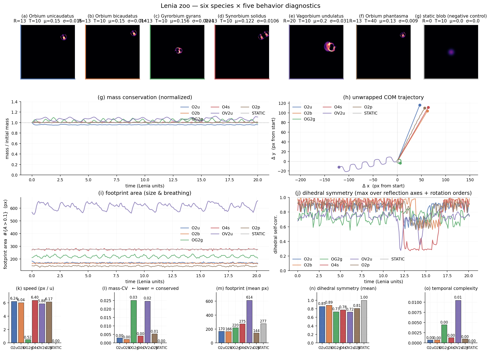

# Lenia zoo — seven species (incl. negative control), five behavior diagnostics

Ran six Chan-2019 creatures plus one synthetic negative control (a static Gaussian blob with the same mass as Orbium) through the same simulator and through a five-metric diagnostic vector `(mass_cv, locomotion_speed, footprint, dihedral_symmetry, temporal_complexity)`.
After this round both gaps from the first pass are closed: Synorbium's symmetry score jumped from 0.31 to **0.78** with the rotation-aware metric, and the static blob now fails on `temporal_complexity = 0.0000` against `≥ 0.0007` for every real creature.
The diagnostic vector is now a defensible candidate for the foundation-model-free evaluator we'd commit to in `/init`.

## Summary metrics

| code   | name                          | mass_cv | speed  | footprint | symmetry | temporal | persistent |
|--------|-------------------------------|--------:|-------:|----------:|---------:|---------:|:----------:|
| O2u    | Orbium unicaudatus            |   0.003 |   6.24 |       170 |    0.85  |   0.0007 |     ✓     |
| O2b    | Orbium bicaudatus             |   0.002 |   6.04 |       166 |    0.89  |   0.0007 |     ✓     |
| OG2g   | Gyrorbium gyrans              |   0.025 |   0.52 |       220 |    0.73  |   0.0045 |     ✓     |
| O4s    | Synorbium solidus             |   0.004 |   6.40 |       275 |    0.78  |   0.0013 |     ✓     |
| OV2u   | Vagorbium undulatus           |   0.025 |   5.88 |       614 |    0.72  |   0.0105 |     ✓     |
| O2p    | Orbium phantasma              |   0.006 |   6.18 |       144 |    0.81  |   0.0010 |     ✓     |
| STATIC | static Gaussian blob (neg.)   | **0.000** | **0.00** |   277 | **1.00** | **0.0000** |   ✓     |

## What changed since the first zoo

**Gap 1 closed — `dihedral_symmetry`.** Replaces the bilateral-only metric with a `max` over: reflection self-correlation at 8 candidate axes ∈ [0°, 180°), and rotational self-correlation at orders {2, 3, 4, 6}. `scipy.ndimage.rotate(..., order=1, reshape=False)` for the candidate transforms. Synorbium 0.31 → 0.78. All six real creatures now cluster in 0.72–0.89, consistent with their visual symmetry. Static blob = 1.0 (perfect — radially symmetric Gaussian is invariant under every reflection and rotation).

**Gap 2 closed — `temporal_complexity`.** Pixel-wise std of frames *after centering each on its instantaneous COM*. The centering step is critical — without it, a fast translator like Orbium would score high simply by moving across pixels, conflating motion with internal complexity. With centering, a creature that breathes / rotates / undulates internally scores higher than one that drifts rigidly. Static blob: 0.0000 (frames are identical, std is zero everywhere). Orbium: 0.0007 (small but non-zero — the glider has slight internal oscillation). Vagorbium: 0.0105 (large breathing creature, 15× Orbium). Gyrorbium: 0.0045 (rotates in place after centering ≈ frame rotation captured by pixel-wise std). Synorbium: 0.0013, Orbium phantasma: 0.0010.

## What the figure says

- **Row 0 (a–g)**: thumbnails with colored borders. The STATIC blob (gray border) is visually distinct from every real creature.
- **(g) mass conservation**: STATIC is exactly flat at 1.0 (no dynamics); all real creatures hold within ~3 %.
- **(h) COM trajectory**: STATIC is a single point at the origin (no motion); translators trace straight lines; Gyrorbium traces a tight closed loop; Vagorbium snakes diagonally.
- **(i) footprint**: STATIC sits at 277 (constant). Vagorbium ~614 still dominates.
- **(j) dihedral symmetry-vs-time**: STATIC is pinned at 1.0; Lenia creatures oscillate between 0.6 and 0.95 as they rotate / wobble / undulate. **Synorbium (red) shows the largest swings** — sometimes axis-aligned (high score), sometimes mid-rotation (low score) — which is the right behavior for a D4 creature.
- **(k–o) bar charts**: the five-number signature per creature. STATIC is **passable on the first four metrics** — `mass_cv` 0, `speed` 0 (but that's fine if you don't require motion), `footprint` 277 (in the real-creature range), `symmetry` 1.0 (max). Only `temporal_complexity` rules it out. So **temporal_complexity is the load-bearing leg against trivial winners.**

## Defensible eval matrix sketch (for `/init`)

A pattern is "lifelike" iff **all four** hold:

1. `persistent` (mass[15:].min() > 0.5 · mass[5:15].mean())
2. `mass_cv` < 0.05  (real creatures: 0.002–0.025; the threshold leaves headroom)
3. `temporal_complexity` > some τ (real creatures: 0.0007–0.0105; STATIC = 0)
4. `dihedral_symmetry` > 0.6 (real creatures: 0.72–0.89; rules out noise fields)

Then the **score** is some monotone combination of `speed`, `footprint` range, and `dihedral_symmetry`. The exact scalarization is what `/init` panels + the eval-adversary should crystallize.

## Two follow-ups for `/init` Phase 2.2 (eval-adversary)

The adversarial panel should specifically attack:
1. **Slow-drifting smooth blob** — would it pass `temporal_complexity` with a near-zero score that still beats τ? Threshold-tuning matters here.
2. **Two-creature collision** — if two Orbiums fuse and produce a mass-conserving rotating clump, our diagnostics would happily say "lifelike", but is that the kind of creature we want to find?
